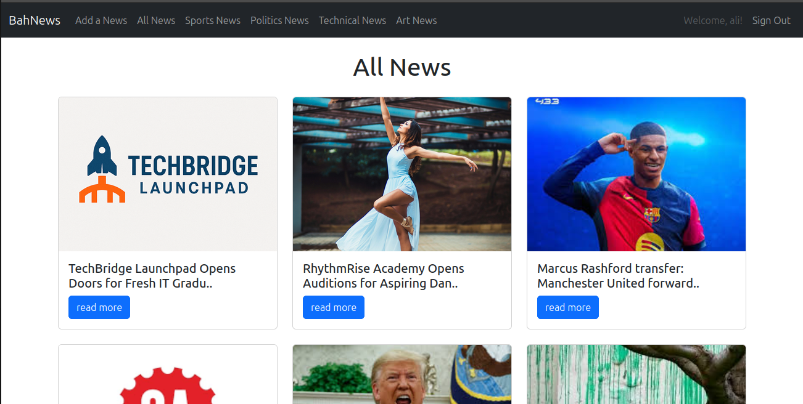

# 📰 Newspaper App

## 🗞️ Description

A simple web-based newspaper platform for sharing news and trending events.  
Users can create, edit, and delete posts, while others can browse and read articles.

This project was built to practice full-stack web development and user-based content publishing.

## 🌐 Live Website

**Access the app here:**  
👉 [https://bah-news-e9cf50add722.herokuapp.com](https://bah-news-e9cf50add722.herokuapp.com)

## 📂 How to Use

1. Visit the website using the link above.
2. Browse through the latest news articles.
3. Log in to create, edit, or delete posts (if you have an account).

## 🔧 Features

- Add, edit, and delete news posts
- Each post linked to a specific user (publisher)
- Upload images for posts
- Clean and responsive layout

## 🛠️ Built With

- HTML  
- CSS  
- JavaScript  
- Node.js  
- Express.js  
- MongoDB  
- EJS Templating

## 🚧 Future Ideas

- Add categories like "Tech", "Politics", etc.
- Enable comments on posts
- Improve mobile responsiveness
- Add search and filter options

## 👨‍💻 Author

**Ali Alashawal**  
[GitHub](https://github.com/Aliashwal03)
